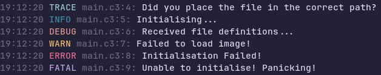

# log.c3 - A simple logging library for the [C3 Programming Language](https://c3-lang.org/)

| [📀 Installation & Usage](./INSTALL.md) | [🧑‍💻 Development](./DEVELOPMENT.md) | [🤝 Contributing](./CONTRIBUTING.md) | [📜 License](./LICENSE) |

**Log.c3** is a light and simple [C3](https://c3-lang.org/) logging library!

This library takes heavy inspiration from [Rxi's log.c logging library for C](https://github.com/rxi/log.c).

## Contributors

- [Kenta](https://github.com/Its-Kenta) - Creator and maintainer